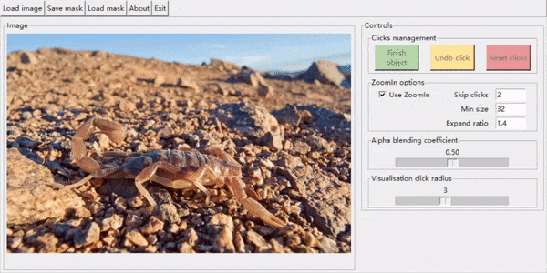

# InterFormer
This repo is the official implementation of "InterFormer: Real-time Interactive Image Segmentation"


# Introduction
InterFormer follows a new pipeline to address the issues of existing pipeline's low computational efficiency. InterFormer extracts and preprocesses the computationally time-consuming part i.e. image processing from the existing process. Specifically, InterFormer employs a large vision transformer (ViT) on high-performance devices to preprocess images in parallel, and then uses a lightweight module called interactive multi-head self attention (I-MSA) for interactive segmentation. InterFormer achieves real-time high-quality interactive segmentation on CPU-only devices.


# Demo
The following GIF animations were created on CPU-only devices:

   

   

  


# Usage
## Install

### Requirements
Ensure the following requirements are met before proceeding with the installation process:
- Python 3.8+
- PyTorch 1.12.0
- mmcv-full 1.6.0
- mmsegmentation 0.26.0

### Install PyTorch

To install PyTorch, please refer to the following resource: [INSTALLING PREVIOUS VERSIONS OF PYTORCH](https://pytorch.org/get-started/previous-versions/)

### Install mmcv-full
```shell
pip install -U openmim
mim install mmcv-full==1.6.0
```

### Install mmsegmentation
```shell
cd mmsegmentation
pip install -e .
```

### Install Additional Dependency
```shell
pip install -r requirements.txt
```

## Data preparation

### COCO Dataset
To download the COCO dataset, please refer to [cocodataset](https://cocodataset.org/#download). You will need to download the following: [2017 Train Images](http://images.cocodataset.org/zips/train2017.zip), [2017 Val images](http://images.cocodataset.org/zips/val2017.zip) and [2017 Panoptic Train/Val annotations](http://images.cocodataset.org/annotations/panoptic_annotations_trainval2017.zip) into `data`

Alternatively, you can use the following script:
```shell
cd data/coco2017
bash coco2017.sh
```

The data is organized as follows:
```
data/coco2017/
├── annotations
│   ├── panoptic_train2017 [118287 entries exceeds filelimit, not opening dir]
│   ├── panoptic_train2017.json
│   ├── panoptic_val2017 [5000 entries exceeds filelimit, not opening dir]
│   └── panoptic_val2017.json
├── coco2017.sh
├── train2017 [118287 entries exceeds filelimit, not opening dir]
└── val2017 [5000 entries exceeds filelimit, not opening dir]
```

### LVIS Dataset

To download the LVIS dataset, please refer to [lvisdataset](https://www.lvisdataset.org/dataset) to download the images and annotations.

The data is organized as follows:
```
data/lvis/
├── lvis_v1_train.json
├── lvis_v1_train.json.zip
├── lvis_v1_val.json
├── lvis_v1_val.json.zip
├── train2017 [118287 entries exceeds filelimit, not opening dir]
├── train2017.zip
├── val2017 [5000 entries exceeds filelimit, not opening dir]
└── val2017.zip
```

### SBD Dataset
To download the SBD dataset, please refer to [SBD](http://home.bharathh.info/pubs/codes/SBD/download.html).

The data is organized as follows:
```
data/sbd/
├── benchmark_RELEASE
│   ├── dataset
│   │   ├── cls [11355 entries exceeds filelimit, not opening dir]
│   │   ├── img [11355 entries exceeds filelimit, not opening dir]
│   │   ├── inst [11355 entries exceeds filelimit, not opening dir]
│   │   ├── train.txt
│   │   └── val.txt
└── benchmark.tgz
```


### DAVIS & GrabCut & Berkeley Datasets

Please download [DAVIS](https://github.com/saic-vul/fbrs_interactive_segmentation/releases/download/v1.0/DAVIS.zip)
[GrabCut](https://github.com/saic-vul/fbrs_interactive_segmentation/releases/download/v1.0/GrabCut.zip)
[Berkeley](https://github.com/saic-vul/fbrs_interactive_segmentation/releases/download/v1.0/Berkeley.zip) from [Reviving Iterative Training with Mask Guidance for Interactive Segmentation](https://github.com/SamsungLabs/ritm_interactive_segmentation#reviving-iterative-training-with-mask-guidance-for-interactive-segmentation)

The data is organized as follows:
```
data/
├── berkeley
│   └── Berkeley
│       ├── gt [100 entries exceeds filelimit, not opening dir]
│       ├── img [100 entries exceeds filelimit, not opening dir]
│       └── list
│           └── val.txt
├── davis
│   └── DAVIS
│       ├── gt [345 entries exceeds filelimit, not opening dir]
│       ├── img [345 entries exceeds filelimit, not opening dir]
│       └── list
│           ├── val_ctg.txt
│           └── val.txt
└── grabcut
    └── GrabCut
        ├── gt [50 entries exceeds filelimit, not opening dir]
        ├── img [50 entries exceeds filelimit, not opening dir]
        └── list
            └── val.txt

```

## Training

### MAE-Pretrained Weight

To download and transform the MAE-pretrained weights into mmseg-style, please refer to [MAE](mmsegmentation/configs/mae/README.md).

E.g.

```shell
python tools/model_converters/beit2mmseg.py https://dl.fbaipublicfiles.com/mae/pretrain/mae_pretrain_vit_base.pth pretrain/mae_pretrain_vit_base_mmcls.pth
```

The required weight files are located in the `pretrain` directory and are organized as follows:
```
pretrain
├── mae_pretrain_vit_base_mmcls.pth
└── mae_pretrain_vit_large_mmcls.pth
```

### Start Training

To start the training of InterFormer-Light, run the following script:
```shell
CUDA_VISIBLE_DEVICES=0,1,2,3 bash tools/dist_train.sh configs/interformer_light_coco_lvis_320k.py 4 --seed 42 --no-validate
```
To train InterFormer-Tiny, use the following script:
```shell
CUDA_VISIBLE_DEVICES=0,1,2,3 bash tools/dist_train.sh configs/interformer_tiny_coco_lvis_320k.py 4 --seed 42 --no-validate
```

The trained weights are stored in `work_dirs/interformer_light_coco_lvis_320k` or `work_dirs/interformer_tiny_coco_lvis_320k`.

## Evaluation

The trained weights are available at [InterFormer](https://drive.google.com/drive/folders/1kEll7pqulpE00JcCvSut0e9C4peKDWRe?usp=sharing)

To start the evaluation on the GrabCut, Berkeley, SBD, or DAVIS dataset, use the following script:
```shell
CUDA_VISIBLE_DEVICES=0,1,2,3 bash tools/dist_clicktest.sh ${CHECKPOINT_FILE} ${GPU_NUM} [--dataset ${DATASET_NAME}] [--size_divisor ${SIZE_DIVISOR}]
```

where `CHECKPOINT_FILE` is the path to the trained weight file, `GPU_NUM` is the number of GPUs used for evaluation, `DATASET_NAME` is the name of the dataset to evaluate on, and `SIZE_DIVISOR` is the divisor used to pad the image. The script will look for the `CONFIG_FILE` in the same folder of `CHECKPOINT_FILE` (`.py` extension).

For example, assume the data is organized as follows:

```
work_dirs/
└── interformer_tiny_coco_lvis_320k
    ├── interformer_tiny_coco_lvis_320k.py
    └── iter_320000.pth
```

To evaluate on SBD with InterFormer-Tiny, run:

```shell
CUDA_VISIBLE_DEVICES=0,1,2,3 bash tools/dist_clicktest.sh work_dirs/interformer_tiny_coco_lvis_320k/iter_320000.pth 4 --dataset sbd --size_divisor 32
```
This command will start the evaluation by specifying the trained weight file `work_dirs/interformer_tiny_coco_lvis_320k/iter_320000.pth` and loading the configuration file `interformer_tiny_coco_lvis_320k.py` in the same folder.

The results are stored in `work_dirs/interformer_tiny_coco_lvis_320k/clicktest_sbd_iter_320000_xxxx.json`.


## Running Demo

To run the demo directly with Python, use the following command in your terminal:
```shell
python demo/main.py path/to/checkpoint --device [cpu|cuda:0]
```
where:

- path/to/checkpoint specifies the path to the checkpoint file that will be loaded before running the program.
- --device specifies the device to use, either cpu or gpu.

Here's an example script to run the demo:
```shell
python demo/main.py work_dirs/interformer_tiny_coco_lvis_320k/iter_320000.pth --device cpu
```
